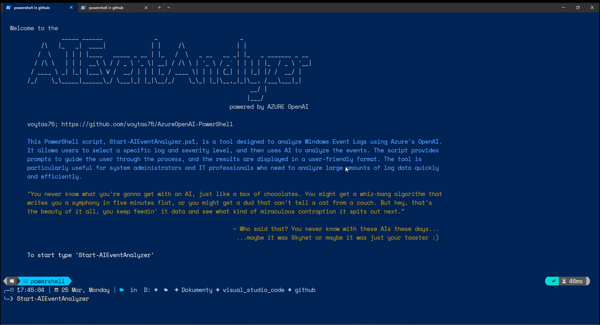

# Start-AIEventAnalyzer

[](https://www.powershellgallery.com/packages/Start-AIEventAnalyzer)

> You never know what you're gonna get with an AI, just like a box of chocolates. You might get a whiz-bang algorithm that writes you a symphony in five minutes flat, or you might get a dud that can't tell a cat from a couch. But hey, that's the beauty of it all, you keep feedin' it data and see what kind of miraculous contraption it spits out next.

This PowerShell script, `Start-AIEventAnalyzer.ps1`, is designed to analyze Windows event logs using AI. It prompts the user to select an action, a log to analyze, the severity level of the events, and the number of most recent events to analyze. The script then invokes an AI model to analyze the selected events and logs the results.
This script utilizes the [PSAOAI](../PSAOAI/README.md) ([PowerShell Gallery](https://www.powershellgallery.com/packages/PSAOAI/)) module, which contains functions essential for the operation of the AIEventAnalyzer.

## Using AI for Dynamic Event Data Analysis

The `Start-AIEventAnalyzer.ps1` script uses AI to dynamically analyze event data in various ways. The user is prompted to select an action from the following options:

- **Analyze**: The AI will analyze the event data and provide insights.
- **Troubleshoot**: The AI will identify potential issues and suggest solutions.
- **Correlate**: The AI will find correlations between different events.
- **Predict**: The AI will predict future events based on the current data.
- **Optimize**: The AI will suggest optimizations based on the event data.
- **Audit**: The AI will audit the event data for any anomalies or discrepancies.
- **Automate**: The AI will suggest ways to automate tasks based on the event data.
- **Educate**: The AI will provide educational content related to the event data.
- **Documentation**: The AI will generate documentation based on the event data.
- **Summarize**: The AI will summarize the key points from the event data.

The chosen action determines the main prompt for the AI. This main prompt then generates sub-prompts that guide the AI in performing the selected action. The AI's responses to these sub-prompts provide the desired analysis, troubleshooting, correlation, prediction, optimization, audit, automation, education, documentation, or summary of the event data.

This dynamic approach allows the AI to provide a wide range of analyses and insights, tailored to the user's specific needs and the unique characteristics of the event data.



## Prerequisites

Before running the `Start-AIEventAnalyzer.ps1` script, you need to set up your environment to use Azure OpenAI. Here are the steps to follow:

1. **PSAOAI module**: Install [PSAOAI](../PSAOAI/README.md) ([PowerShell Gallery](https://www.powershellgallery.com/packages/PSAOAI/)) module.
   
   ```powershell
   Install-Module -Name PSAOAI
   ```

2. **Azure OpenAI Service**: You need to have an active Azure subscription and access to Azure OpenAI Service.

3. **API Key**: You need to generate an API key from the Azure OpenAI Service. This key is used to authenticate your requests to the service.

4. **Environment Variables**: You need to set up the following environment variables in your system:

    - `API_AZURE_OPENAI_KEY`: This should be set to the API key you generated from the Azure OpenAI Service.
    - `API_AZURE_OPENAI_ENDPOINT`: This should be set to the endpoint URL of the Azure OpenAI Service. Typically, it is in the format `https://<RESOURCE_NAME>.openai.azure.com`.
    - `API_AZURE_OPENAI_DEPLOYMENT`: The deployment name is used to call the model. We recommend using GPT-4 or GPT-4-preview for optimal results.
    - `API_AZURE_OPENAI_APIVERSION `: Version of Azure OpenAI API. <https://learn.microsoft.com/en-us/azure/ai-services/openai/api-version-deprecation>

## Syntax

```powershell
. .\Start-AIEventAnalyzer.ps1
```

## Parameters

The script does not take any parameters. Instead, it prompts the user for the following inputs:

- **Action**: The type of analysis to perform. Options include "Analyze", "Troubleshoot", "Correlate", "Predict", "Optimize", "Audit", "Automate", "Educate", "Documentation", "Summarize".
- **LogName**: The name of the Windows event log to analyze.
- **Severity Level**: The severity level of the events to analyze. Options include "Critical", "Error", "Warning", "Information", "Verbose", "All".
- **Number of Events**: The number of most recent events to analyze.

## Examples

```powershell
PS C:\>. .\Start-AIEventAnalyzer.ps1; Start-AIEventAnalyzer -LogName "Microsoft-Windows-AAD/Operational" -Serverity All -Action Optimize -Events 50
```

The script will generate a menu for deeper analysis of the optimization.

```powershell
PS C:\>. .\Start-AIEventAnalyzer.ps1; Start-AIEventAnalyzer
```

The script will prompt the user for the required inputs (`action`, `logname`, `serverity`, `events`), including the API Azure OPENAI variable values described in the Environment Variables section above.

## Output

The script outputs the results of the AI analysis to a text file in the `LogFolder` directory.  The file name is in the format `Action-LogName-SeverityLevel-DateTime.txt`.

- **LogFolder** (Optional): Specifies the directory where the output log files will be stored. If not provided, the script will create and use a directory named "AIEventAnalyzer" in the user's "MyDocuments" folder.

The output file contains the following information:

- The chosen action, log name, severity level, and event count.
- The prompt used for the AI analysis.
- The results of the AI analysis in JSON format.

The script also displays the chosen action, log name, severity level, and event count in the console.
